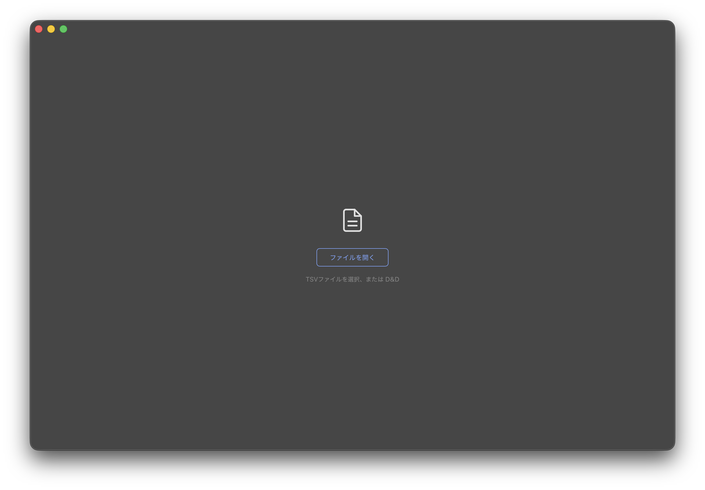
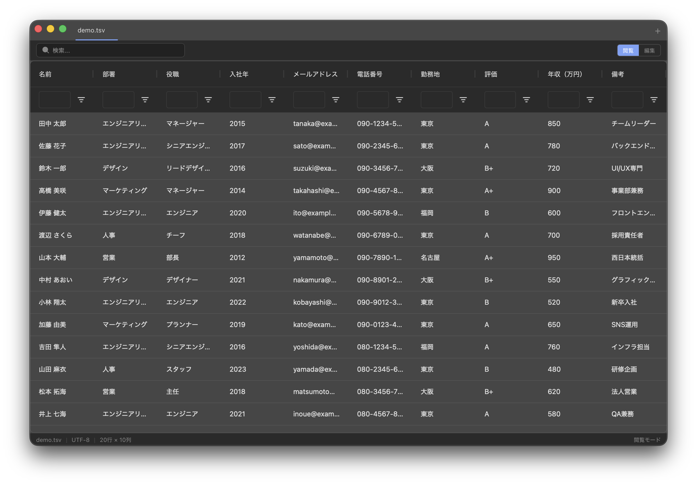
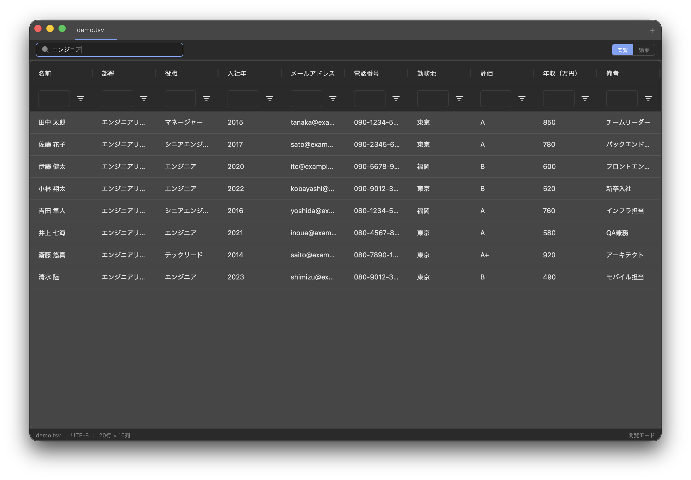
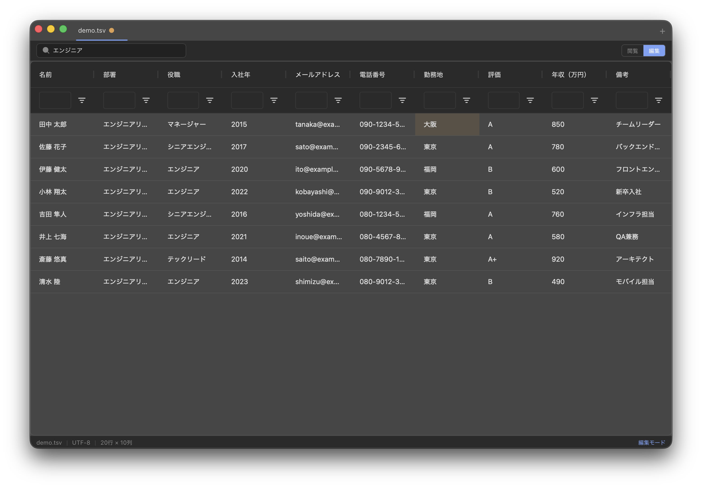

# TSV Viewer

DBエクスポート等のTSVファイルを軽量に閲覧・編集するデスクトップアプリケーション。数十万行規模のデータに対応。

## スクリーンショット

|                起動画面                 |                  テーブル表示                  |
| :-------------------------------------: | :--------------------------------------------: |
|  |  |

|                  フィルタリング                   |                 編集モード                  |
| :-----------------------------------------------: | :-----------------------------------------: |
|  |  |

## 主な機能

- TSVファイルの閲覧・編集（AG Grid による高速テーブル表示）
- 仮想スクロールで数十万行に対応
- カラムフィルタ・ソート・全文検索
- セル単位の編集、行の追加・削除、Undo / Redo
- マルチタブ対応
- 文字コード自動判定（UTF-8 / Shift-JIS）
- ファイルの D&D 読み込み

## 試してみる

`examples/demo.tsv` を開くと、すぐに動作を確認できます。

## 技術スタック

| レイヤー       | 技術                               |
| -------------- | ---------------------------------- |
| シェル         | Tauri v2                           |
| フロントエンド | Svelte 5 + TypeScript              |
| テーブルUI     | AG Grid Community (ag-grid-svelte) |
| バックエンド   | Rust                               |

## 開発

```bash
# 開発サーバー起動
npm run tauri dev

# ビルド
npm run tauri build

# フロントエンドの型チェック
npm run check

# Rust の型チェック
cd src-tauri && cargo check
```
